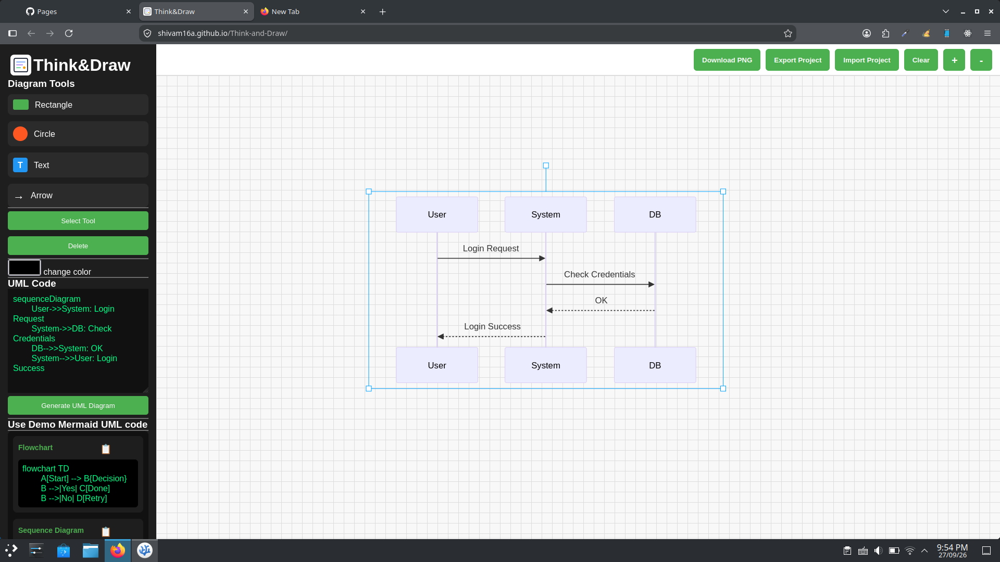

# Think&Draw 🎨📐

<p align="center">
  
</p>

<p align="center">
  <strong>A lightweight, browser-based interactive diagramming canvas and automated Mermaid UML renderer.</strong>
</p>

<p align="center">
  <a href="https://shivam16a.github.io/Think-and-Draw/" target="_blank">
    
  </a>
  
  
  
  
  
</p>

<p align="center">
  🔗 <strong>Live Application:</strong> <a href="https://shivam16a.github.io/Think-and-Draw/">https://shivam16a.github.io/Think-and-Draw/</a>
</p>

---

## 📌 Overview

**Think&Draw** is an open-source, dual-mode visual diagramming tool designed for software developers, system architects, and students. It integrates manual drag-and-drop vector drawing tools with an automated **Mermaid.js** code-to-diagram compiler. Users can rapidly prototype software architectures, write syntax-driven flowcharts or sequence diagrams, manipulate geometric primitives on an infinite-feel grid canvas, and export their graphics for technical documentation.

---

## ✨ Key Features

- ⚡ **Mermaid.js Code-to-Diagram Generator**: Instantly compile raw text into clean, professional diagrams (Flowcharts, Sequence Diagrams, Class Diagrams, and ER Diagrams).
- 📋 **Built-In Architecture Code Templates**: Pre-configured sample snippets with one-click copy options for faster iteration.
- 📐 **Interactive Konva.js Canvas**: Smooth object rendering supporting drag, resize, rotate, and multi-selection primitives (Rectangles, Circles, Arrows, and Text labels).
- 🎨 **Dynamic Custom Styling**: In-place color picker to customize node fills, border outlines, and text elements.
- 💾 **Export & Import Workspaces**:
  - **PNG Export**: Save production-ready raster graphics for documentation and presentations.
  - **JSON Project State**: Export and import complete canvas states to resume work seamlessly.
- 🔍 **Navigation Controls**: Smooth zoom in, zoom out, canvas clear, and expandable sidebar toggle.
- 🖥️ **Desktop-Optimized Workspace**: Guarded with an informative display prompt on mobile devices to preserve precise desktop vector alignment.

---

## 📸 Interface Preview

<div align="center">
  
  <p><em>Interactive grid workspace showcasing Mermaid Sequence Diagram compilation alongside vector tools.</em></p>
</div>

---

## 🛠️ Tech Stack

* **Canvas Engine**: [Konva.js v9](https://konvajs.org/) (HTML5 2D Canvas abstraction)
* **Diagram Compiler**: [Mermaid.js v10](https://mermaid.js.org/)
* **Frontend Core**: Vanilla JavaScript (ES6+), Semantic HTML5
* **Styling**: Responsive CSS3 with custom grid patterns and side panel transitions
* **Deployment**: GitHub Pages

---

## 📂 Project Structure

```text
Think&Draw/
├── images/
│   └── image.png        # Application dashboard preview
├── app.js               # Konva canvas handlers, Mermaid integration & export logic
├── index.html           # DOM layout, sidebar tools, and script loaders
├── style.css            # Grid styling, glass panels, and desktop view rules
├── think&draw.svg       # Vector application branding
└── README.md            # Comprehensive project documentation

```

---

## ⚙️ Getting Started

### 1. Clone the Repository

```bash
git clone https://github.com/Shivam16a/Think-and-Draw.git
cd Think-and-Draw

```

### 2. Run Locally

Because Think&Draw uses lightweight vanilla web standards and CDN-delivered modules, no package installation or build process is required:

* **VS Code Live Server**: Right-click `index.html` and choose **"Open with Live Server"**.
* **Python Simple Server**:

* **Browser Direct**: Open `index.html` in Chrome, Firefox, Edge, or Brave on a desktop/laptop.

---

## 🚀 Usage Guide

1. **Draw Shapes**: Click on `Rectangle`, `Circle`, `Text`, or `Arrow` from the left sidebar to add shapes to the canvas.
2. **Compile UML**:
* Write or paste Mermaid code into the **UML Code** box.
* Click **Generate UML Diagram** to render it directly on the canvas.


3. **Customize**: Select any item using the **Select Tool** and apply colors using the color picker.
4. **Save**: Click **Download PNG** to export the image, or use **Export Project** to save canvas state in JSON format.

---

## 👤 Author

* **GitHub**: [@Shivam16a](https://www.google.com/search?q=https://github.com/Shivam16a&utm_source=gemini)
* **Live Demo**: [https://shivam16a.github.io/Think-and-Draw/](https://www.google.com/url?sa=E&source=gmail&q=https://shivam16a.github.io/Think-and-Draw/)
